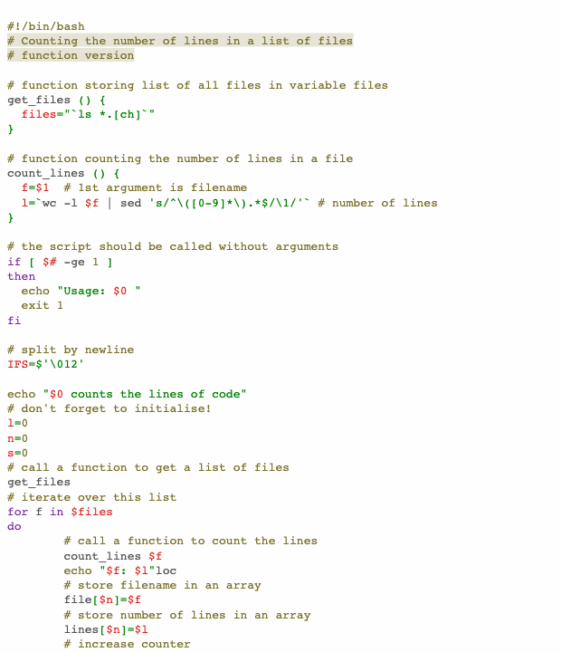

# A11y light high contrast

This is the pygments implementation of [`a11y light`](https://github.com/ericwbailey/a11y-syntax-highlighting) with high contrast.

## Colors

Background color:  `#fefefe`

Highlight color:  `#7971292e`

**WCAG compliance**

| Color                                                        | Hex       | Ratio    | Normal text | Large text |
| ------------------------------------------------------------ | --------- | -------- | ----------- | ---------- |
|  | `#d91e18` | 5.02 : 1 | AA          | AAA        |
|  | `#797129` | 4.87 : 1 | AA          | AAA        |
|  | `#008000` | 5.09 : 1 | AA          | AAA        |
|  | `#007faa` | 4.51 : 1 | AA          | AAA        |
|  | `#7928a1` | 7.91 : 1 | AAA         | AAA        |
|  | `#545454` | 7.51 : 1 | AAA         | AAA        |
