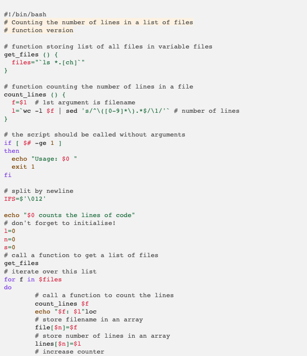

# A11Y Light

This style mimics the a11 light theme from eric bailey's accessible themes.

## Colors

Background color:  `#fefefe`

Highlight color:  `#7971292e`

**WCAG compliance**

| Color                                                        | Hex       | Ratio   | Normal text | Large text |
| ------------------------------------------------------------ | --------- | ------- | ----------- | ---------- |
|  | `#696969` | 5.4 : 1 | AA          | AAA        |

|  | `#d91e18` | 5.0 : 1 | AA | AAA |

|  | `#aa5d00` | 4.9 : 1 | AA | AAA |

|  | `#008000` | 5.1 : 1 | AA | AAA |

|  | `#007faa` | 4.5 : 1 | AA | AAA |

|  | `#7928a1` | 7.9 : 1 | AAA | AAA |

|  | `#545454` | 7.5 : 1 | AAA | AAA |
