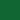

# A11Y Light

This style inspired by the a11y-light theme from eric bailey's accessible themes.

## Colors

Background color:  `#fefefe`

Highlight color:  `#fdf2e2`

**WCAG compliance**

| Color                                             | Hex       | Ratio    | Normal text | Large text |
| ------------------------------------------------- | --------- | -------- | ----------- | ---------- |
|  | `#515151` | 7.9 : 1  | AAA         | AAA        |
|  | `#d71835` | 5.1 : 1  | AA          | AAA        |
|  | `#7f4707` | 7.4 : 1  | AAA         | AAA        |
|  | `#116633` | 7.0 : 1  | AAA         | AAA        |
|  | `#00749c` | 5.2 : 1  | AA          | AAA        |
|  | `#8045e5` | 5.3 : 1  | AA          | AAA        |
|  | `#1e1e1e` | 16.5 : 1 | AAA         | AAA        |
