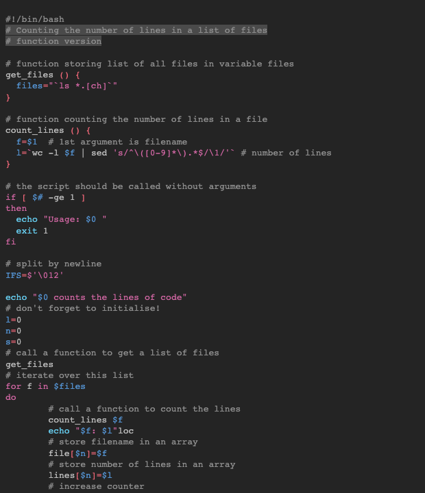

# Blinds dark

This is the pygments implementation of [`blinds dark`](https://github.com/orbulant/blinds-theme).

## Colors

Background color:  `#242424`

Highlight color:  `#66666691`

**WCAG compliance**

| Color                                                        | Hex       | Ratio   | Normal text | Large text |
| ------------------------------------------------------------ | --------- | ------- | ----------- | ---------- |
|  | `#8C8C8C` | 4.6 : 1 | AA          | AAA        |
|  | `#ee6677` | 5 : 1   | AA          | AAA        |
|  | `#ccbb44` | 8.1 : 1 | AAA         | AAA        |
|  | `#66ccee` | 8.5 : 1 | AAA         | AAA        |
|  | `#5391CF` | 4.7 : 1 | AA          | AAA        |
|  | `#D166A3` | 4.5 : 1 | AA          | AAA        |
|  | `#bbbbbb` | 8.1 : 1 | AAA         | AAA        |
