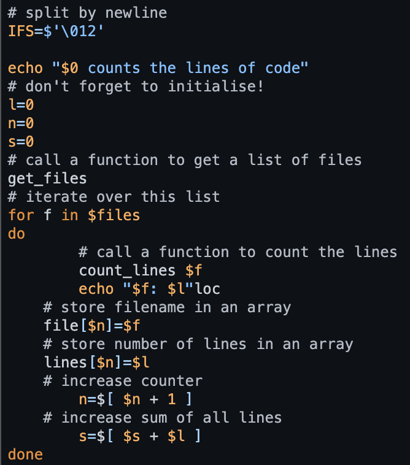

# Github Dark Colorblind

This style mimics the github dark colorblind theme from vscode.

## Colors

Background color:  `#0d1117`

Highlight color:  `#58a6ff70`

**WCAG compliance**

| Color                                                        | Hex       | Ratio    | Normal text | Large text |
| ------------------------------------------------------------ | --------- | -------- | ----------- | ---------- |
|  | `#b1bac4` | 9.6 : 1  | AAA         | AAA        |
|  | `#ec8e2c` | 7.6 : 1  | AAA         | AAA        |
|  | `#fdac54` | 10.1 : 1 | AAA         | AAA        |
|  | `#a5d6ff` | 12.3 : 1 | AAA         | AAA        |
|  | `#79c0ff` | 9.7 : 1  | AAA         | AAA        |
|  | `#d2a8ff` | 9.7 : 1  | AAA         | AAA        |
|  | `#C9D1D9` | 12.3 : 1 | AAA         | AAA        |
