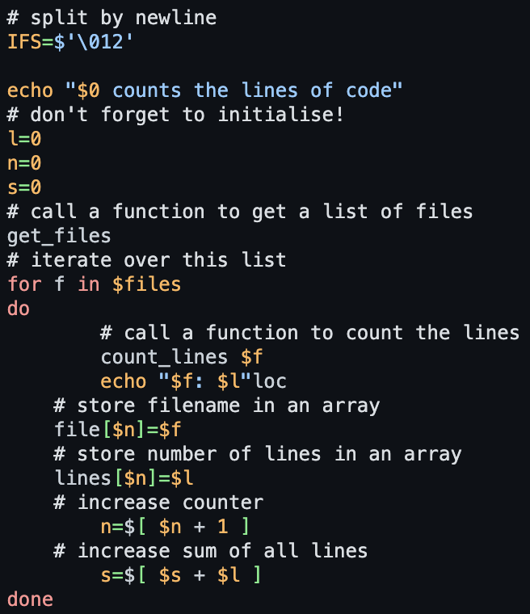

# Github dark high contrast

This is the pygments implementation of [`github dark (Default)`](https://github.com/primer/github-vscode-theme).

## Colors

Background color:  `#0d1117`

Highlight color:  `#58A6FF`

**WCAG compliance**

| Color | Hex | Ratio | Normal text | Large text |
| ----- | --- | ----- | ----------- | ---------- |
|  | `#d9dee3` | 14.1 : 1 | AAA | AAA |
|  | `#ff9492` | 8.9 : 1 | AAA | AAA |
|  | `#ffb757` | 11.1 : 1 | AAA | AAA |
|  | `#72f088` | 13.1 : 1 | AAA | AAA |
|  | `#91cbff` | 11.1 : 1 | AAA | AAA |
|  | `#dbb7ff` | 11.1 : 1 | AAA | AAA |
|  | `#C9D1D9` | 12.3 : 1 | AAA | AAA |
