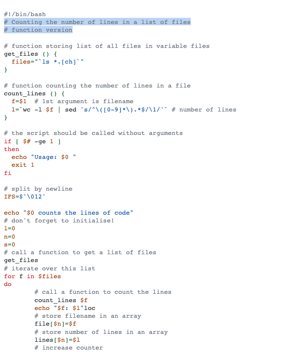

# Github light

This is the pygments implementation of [`github light (Default)`](https://github.com/primer/github-vscode-theme).

## Colors

Background color:  `#ffffff`

Highlight color:  `#5a32a3`

**WCAG compliance**

| Color | Hex | Ratio | Normal text | Large text |
| ----- | --- | ----- | ----------- | ---------- |
|  | `#6a737d` | 4.8 : 1 | AA | AAA |
|  | `#d73a49` | 4.6 : 1 | AA | AAA |
|  | `#c24e00` | 4.8 : 1 | AA | AAA |
|  | `#22863a` | 4.6 : 1 | AA | AAA |
|  | `#005cc5` | 6.3 : 1 | AA | AAA |
|  | `#6f42c1` | 6.5 : 1 | AA | AAA |
|  | `#24292e` | 14.7 : 1 | AAA | AAA |
