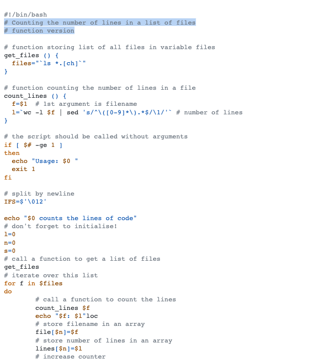

# Github Light Colorblind

This style mimics the github light colorblind theme from vscode themes.

## Colors

Background color:  `#ffffff`

Highlight color:  `#0969da4a`

**WCAG compliance**

| Color                                                        | Hex       | Ratio   | Normal text | Large text |
| ------------------------------------------------------------ | --------- | ------- | ----------- | ---------- |
|  | `#6e7781` | 4.5 : 1 | AA          | AAA        |

|  | `#b35900` | 4.8 : 1 | AA | AAA |

|  | `#8a4600` | 7.1 : 1 | AAA | AAA |

|  | `#0550ae` | 7.6 : 1 | AAA | AAA |

|  | `#8250df` | 5.0 : 1 | AA | AAA |

|  | `#24292f` | 14.7 : 1 | AAA | AAA |
