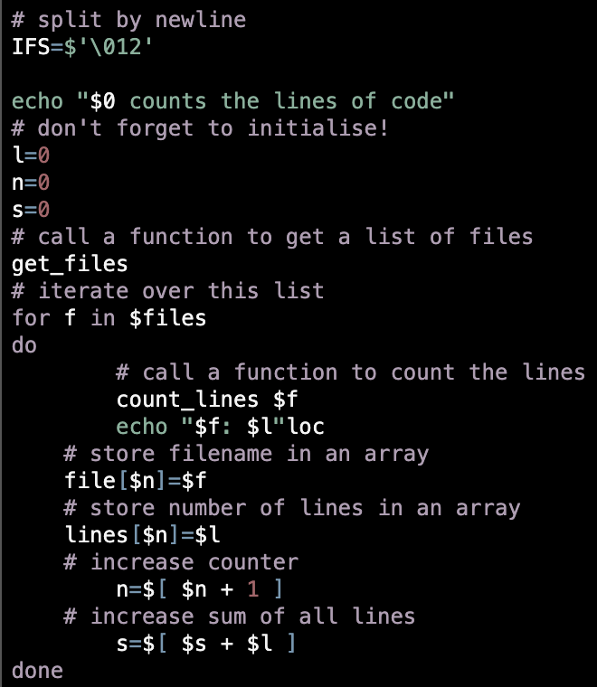

# Gotthard dark

This is the pygments implementation of [`gotthard dark`](https://github.com/janbiasi/vscode-gotthard-theme/)

## Colors

Background color:  `#000000`

Highlight color:  `#4c4b4be8`

**WCAG compliance**

| Color | Hex | Ratio | Normal text | Large text |
| ----- | --- | ----- | ----------- | ---------- |
|  | `#F5F5F5` | 19.3 : 1 | AAA | AAA |
|  | `#AB6369` | 4.7 : 1 | AA | AAA |
|  | `#B89784` | 7.8 : 1 | AAA | AAA |
|  | `#CAAB6D` | 10.09 : 1 | AAA | AAA |
|  | `#81B19B` | 8.7 : 1 | AAA | AAA |
|  | `#6F98B3` | 6.8 : 1 | AA | AAA |
|  | `#b19db4` | 8.4 : 1 | AAA | AAA |
