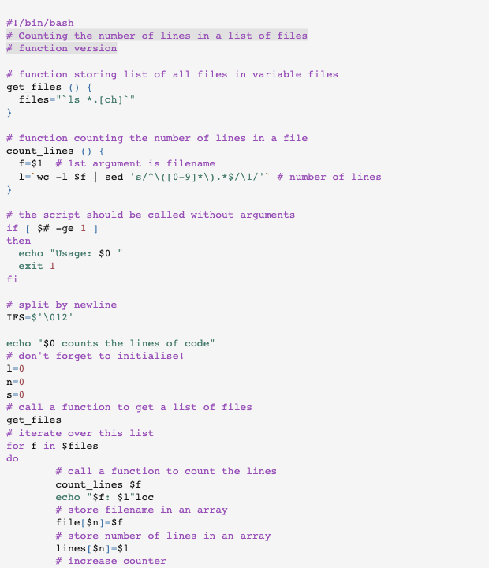

# Gotthard light

This is the pygments implementation of [`gotthard light`](https://github.com/janbiasi/vscode-gotthard-theme/)

## Colors

Background color:  `#F5F5F5`

Highlight color:  `#E1E1E1`

**WCAG compliance**

| Color | Hex | Ratio | Normal text | Large text |
| ----- | --- | ----- | ----------- | ---------- |
|  | `#141414` | 16.9 : 1 | AAA | AAA |
|  | `#9F4E55` | 4.7 : 1 | AA | AAA |
|  | `#A25E53` | 4.5 : 1 | AA | AAA |
|  | `#98661B` | 4.5 : 1 | AA | AAA |
|  | `#437A6B` | 4.6 : 1 | AA | AAA |
|  | `#3D73A9` | 4.6 : 1 | AA | AAA |
|  | `#974EB7` | 4.7 : 1 | AAA | AAA |
