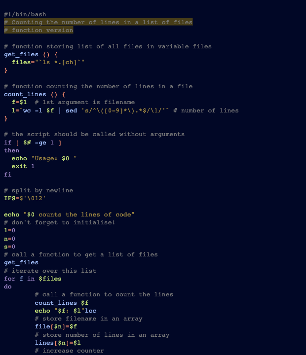

# Greative

This style mimics greative theme from vscode themes.

## Colors

Background color:  `#010726`

Highlight color:  `#473d18`

**WCAG compliance**

| Color                                                        | Hex       | Ratio   | Normal text | Large text |
| ------------------------------------------------------------ | --------- | ------- | ----------- | ---------- |
|  | `#797979` | 4.6 : 1 | AA          | AAA        |

|  | `#F78C6C` | 8.4 : 1 | AAA | AAA |

|  | `#9e8741` | 5.7 : 1 | AA | AAA |

|  | `#c5e478` | 13.9 : 1 | AAA | AAA |

|  | `#a2bffc` | 10.8 : 1 | AAA | AAA |

|  | `#5ca7e4` | 7.6 : 1 | AAA | AAA |

|  | `#9e86c8` | 6.3 : 1 | AA | AAA |
